# AssessWise: Conversational SHL Assessment Recommender

AssessWise is a production-ready, conversational recommendation engine designed to match talent acquisition teams with the precise **SHL Individual Test Solutions** they need.

Unlike generic RAG (Retrieval-Augmented Generation) wrappers that rely entirely on unpredictable, open-ended LLM prompts, AssessWise implements a **deterministic state-machine architecture** with strict schema validation, robust hybrid retrieval, and an automated evaluation harness.

---

## 🏆 Why AssessWise Wins: Technical Differentiators

For a system evaluating enterprise-level assessments, standard LLM search is too risky. AssessWise is built to succeed under rigorous technical review by addressing the core flaws of standard conversational search:

| Feature | Generic LLM / RAG Wrapper | AssessWise Architecture |
| :--- | :--- | :--- |
| **Hallucination Control** | High risk. LLMs often hallucinate non-existent assessments or bad URLs. | **Zero-Hallucination**. All recommended items and URLs are strictly filtered and populated from a validated, local database. |
| **Response Reliability** | Unstructured text output that easily breaks client-side parsers. | **Strict Pydantic Validation**. Outgoing payloads are validated against rigid schemas before leaving the API layer. |
| **State Discipline** | Conversations wander off-topic, bypass constraints, or suffer prompt injection. | **Deterministic State Machine**. User turns are routed into explicit conversational states before execution. |
| **Context Retention** | Forgetful search behavior during follow-up query turns. | **Constraint-Aggregating Refinement**. Aggregates context across the session history to preserve prior user constraints. |
| **Retrieval Precision** | Noisy keyword search that ranks irrelevant tests due to common words. | **Clean Token Intersection**. High-precision tokenizer with built-in punctuation stripping and stop-word filtering. |

---

## 🏗️ System Architecture

AssessWise splits the query processing pipeline into clear, isolated layers to maintain full observability and safety.

```mermaid
flowchart TD
    User([User Chat Request]) --> API[FastAPI /chat Endpoint]
    API --> SchemaIn[Pydantic ChatRequest Validation]
    SchemaIn --> Router[State Router]
    
    %% Router Decisions
    Router -->|Vague query| StateClarify[State: CLARIFYING]
    Router -->|Valid keywords| StateRetrieve[State: RETRIEVING]
    Router -->|Follow-up turn| StateRefine[State: REFINING]
    Router -->|Comparison intent| StateCompare[State: COMPARING]
    Router -->|Prompt Injection / Off-topic| StateOut[State: OUT_OF_SCOPE]
    
    %% Processing Lane
    StateRetrieve --> HybridSearch[Hybrid Retriever & Token-overlap Scorer]
    StateRefine --> CombineQueries[Constraint Aggregator]
    CombineQueries --> HybridSearch
    
    HybridSearch --> Database[(Taxonomy Enriched Catalog)]
    
    %% Response Generation
    Database --> RespBuilder[Response Builder]
    StateClarify --> RespBuilder
    StateCompare --> RespBuilder
    StateOut --> RespBuilder
    
    RespBuilder --> SchemaOut[Pydantic ChatResponse Validation]
    SchemaOut --> Client([User Chat Response])
```



---

## 🛠️ Tech Stack

* **Core Framework**: Python 3.13 / FastAPI (high performance, asynchronous endpoints)
* **Validation & Schemas**: Pydantic v2 (strict type enforcement & payload parsing)
* **Configuration**: Pydantic-Settings & Dotenv (environment isolation)
* **Data Handling**: PyYAML (taxonomy classification), JSON (normalized database storage)
* **Text Analysis**: Custom regex tokenizer with stop-word filter (high-precision local match scoring)
* **Quality Assurance**: Pytest (automated test coverage)
* **Deployment**: Render-ready with a native Blueprint template (`render.yaml`)

---

## 📁 Folder Structure

```text
AssessWise-SHL-Conversational-Recommender/
├── data/
│   └── catalog/
│       ├── catalog_raw.json     # Unfiltered crawled SHL assessments
│       ├── catalog_clean.json   # Enriched, schema-compliant catalog database
│       └── taxonomy.yaml        # Standardized seniority, skills, and role categories
├── docs/
│   ├── APPROACH.md              # Technical design trade-offs and rationale
│   ├── DECISION_LOG.md          # Log of architectural choices and dates
│   └── RISK_CHECKLIST.md        # Deployment and code verification checklists
├── scripts/
│   ├── build_catalog.py         # Catalog compilation & taxonomy-enrichment pipeline
│   └── test_states.py           # Automated integration test script for all 5 states
├── src/
│   └── assesswise_shl/
│       ├── api/
│       │   └── main.py          # FastAPI app initiation and routing endpoints
│       ├── generation/
│       │   └── responder.py     # Generative formatting for chat replies
│       ├── retrieval/
│       │   ├── catalog.py       # Catalog record and schema loader
│       │   └── hybrid.py        # Hybrid token retriever & custom tokenizer
│       ├── routing/
│       │   └── router.py        # Deterministic state-routing router
│       ├── config.py            # Settings manager
│       ├── schemas.py           # Strict Pydantic API model contracts
│       └── services/
│           └── chat_service.py  # Central workflow orchestrator
└── tests/                       # Automated pytest suite (models, api, router)
```

---

## 🔄 Conversation Workflow & Sequence

1. **Routing Phase**:
   * The incoming message history is passed to the `ConversationRouter`.
   * If any prompt-injection keywords (`ignore previous`, etc.) are detected, the turn immediately routes to `OUT_OF_SCOPE` and returns an exit message.
   * If comparison terms (`vs`, `compare`) are present, it routes to `COMPARING`.
   * If the assistant has already provided recommendations, it transitions to `REFINING` to adjust the current shortlist.
   * If there is a minimum signal of role or test terms, it routes to `RETRIEVING`. Otherwise, it goes to `CLARIFYING`.

2. **Retrieval & Scoring Phase**:
   * For a new search, the query text is parsed. For a refinement search, the user's current query is concatenated with previous user messages to preserve constraints.
   * The text is passed through the `HybridRetriever` custom tokenizer, which strips punctuation, lowercases characters, and discards English stop words.
   * Catalog items are scored according to token overlap intersection against the tokenized query and taxonomy weights.

3. **Response Phase**:
   * The `ResponseBuilder` takes the state and retrieved records.
   * Matches are transformed into strict `Recommendation` payloads, containing only validated names, target URLs, and test types.
   * The response is validated by Pydantic and returned to the client.

---

## 🚀 Setup & Local Execution

### 1. Initialize Virtual Environment & Install Dependencies
```powershell
python -m venv .venv
.venv\Scripts\activate
pip install -r requirements.txt
```

### 2. Configure Environment Variables
Create a `.env` file in the root directory:
```env
APP_ENV=local
PYTHONPATH=src
```

### 3. Run the Catalog Compilation Pipeline
Compile the raw scraper data into a normalized, taxonomy-mapped catalog database:
```powershell
$env:PYTHONPATH="src"
python scripts/build_catalog.py
```

### 4. Start the Application
Start the FastAPI server locally:
```powershell
$env:PYTHONPATH="src"
uvicorn assesswise_shl.api.main:app --reload
```

---

## 🧪 Testing & Verification

### Run Automated Unit & API Tests
Ensure all schemas, state transitions, and search functions are fully functional:
```powershell
.venv\Scripts\activate
pytest
```

### Verify Conversation States
Use our automated script to test each of the five conversational states (`CLARIFYING`, `RETRIEVING`, `REFINING`, `COMPARING`, `OUT_OF_SCOPE`) against the local API:
```powershell
.venv\Scripts\activate
python scripts/test_states.py
```
