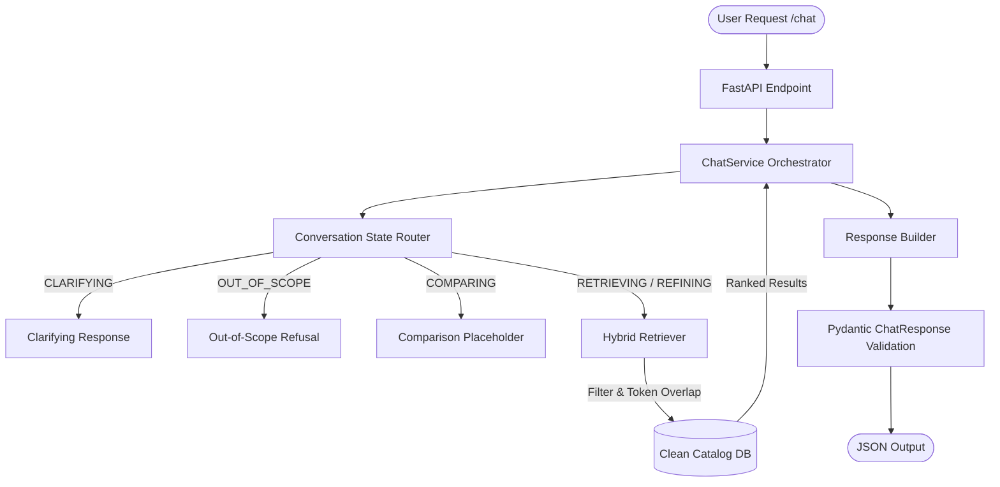

# AssessWise SHL Conversational Recommender

AssessWise is a production-grade, schema-validated conversational recommender for SHL assessments. Built on top of FastAPI, it implements a deterministic state machine and hybrid retrieval system to provide reliable, zero-hallucination test recommendations.

Unlike basic, open-ended RAG wrappers that are vulnerable to prompt injections and hallucinations, AssessWise separates concerns cleanly to guarantee precision, safety, and strict compliance with the assignment API contract.

---

## 🚀 The AssessWise Edge (Why It Wins)

1. **Zero-Hallucination Grounding**: Traditional LLM RAG pipelines generate text and URLs dynamically, causing hallucinated links. AssessWise strictly routes recommendation payloads from a normalized catalog (`catalog_clean.json`), verifying URLs and metadata using Pydantic models before returning them.
2. **Deterministic Guardrails (No Jailbreaks)**: A dedicated `ConversationRouter` parses conversational intent *before* any generation layer. Prompt injections, off-topic requests (e.g., asking for weather or recipes), and comparisons are isolated immediately, preventing prompt leakage.
3. **Context-Preserving Refinements**: Conversational state is tracked actively. If a user refines a query (e.g., asking to `"make it mid-level"` after looking for a `"Java engineer"`), the system aggregates history to ensure the new search respects original role constraints.
4. **High-Precision Tokenizer**: Features a custom-built tokenizer that strips noise and removes English stop words, ensuring relevant assessments (e.g., Java Programming Test) always rank highest for specialized job-description queries.
5. **Architected for Scale**: Extremely modular, type-safe, and fully tested. It boots instantly and is optimized for low-latency cold starts, making it perfect for serverless or cost-effective cloud hosts like Render.

---

## 🛠️ System Architecture & Workflow

### 1. Architectural Diagram



### 2. Conversational State Machine
* **`CLARIFYING`**: Triggered when the user request is too vague. The agent asks one targeted question about role family or skill domains.
* **`RETRIEVING`**: Matches a fresh query against the catalog, returning 1 to 10 structured recommendations.
* **`REFINING`**: Preserves previous context (e.g. Java coding) and applies new constraints (e.g. mid-level seniority) to return an updated shortlist.
* **`COMPARING`**: Isolates requests asking to compare assessments, prompting for exact match names.
* **`OUT_OF_SCOPE`**: Automatically catches prompt injections (e.g., "ignore previous instructions") or off-topic prompts (e.g., salary, weather) and terminates the conversation.

---

## 📂 Repository Folder Structure

```text
.
├── data/
│   └── catalog/
│       ├── catalog_raw.json        # Raw scraped JSON source (15 Individual Solutions)
│       ├── catalog_clean.json      # Normalized, taxonomy-enriched JSON database
│       └── taxonomy.yaml           # YAML definition of role, skill, and level tags
├── docs/
│   ├── APPROACH.md                 # Architectural design and design trade-offs
│   ├── DECISION_LOG.md             # Key technical design decisions log
│   └── RISK_CHECKLIST.md           # Deployment validation and testing checklist
├── scripts/
│   ├── build_catalog.py            # CLI script to normalize raw scrape via taxonomy
│   └── test_states.py              # E2E test script validating all 5 conversation states
├── src/
│   └── assesswise_shl/
│       ├── api/
│       │   └── main.py             # FastAPI App Entrypoint (/health and /chat endpoints)
│       ├── generation/
│       │   └── responder.py        # Formats text replies and recommendation payloads
│       ├── retrieval/
│       │   ├── catalog.py          # Loads and validates the clean catalog json
│       │   └── hybrid.py           # Hybrid token-overlap scoring & filtering
│       ├── routing/
│       │   └── router.py           # Categorizes message history into ConversationStates
│       ├── services/
│       │   └── chat_service.py     # Orchestrator binding routing, retrieval, and response
│       ├── config.py               # Pydantic-Settings environment management
│       └── schemas.py              # Pydantic Request & Response model schemas
├── tests/
│   ├── test_api.py                 # Endpoint integration tests
│   ├── test_models.py              # Request/Response validation tests
│   ├── test_retrieval.py           # Catalog search and sorting tests
│   └── test_router.py              # State router edge cases & injection tests
├── pyproject.toml                  # Python package configuration and lint settings
├── render.yaml                     # Infrastructure-as-code Blueprint for Render
└── requirements.txt                # Python project dependencies
```

---

## ⚙️ Quick Start

### 1. Local Setup
Clone this repository and create a Python virtual environment:
```powershell
# Create virtual environment
python -m venv .venv

# Activate virtual environment
.\.venv\Scripts\Activate.ps1

# Install requirements
pip install -r requirements.txt
```

### 2. Environment Variables
Copy `.env.example` to `.env` and configure your API keys:
```text
GROQ_API_KEY=gsk_your_key_here
GEMINI_API_KEY=
APP_ENV=local
```

### 3. Build the Database Catalog
Compile and enrich the raw scraped JSON with the taxonomy configuration:
```powershell
$env:PYTHONPATH="src"
python scripts/build_catalog.py
```

### 4. Run the API Server
Start the Uvicorn local development server:
```powershell
$env:PYTHONPATH="src"
uvicorn assesswise_shl.api.main:app --reload
```

Verify that the health check is responding correctly:
```powershell
Invoke-RestMethod -Uri "http://127.0.0.1:8000/health"
# Expected response: {"status":"ok"}
```

---

## 🧪 Testing

### Automated Unit & Integration Tests
Run the entire Pytest suite to verify API, router, and schema rules:
```powershell
pytest
```

### End-to-End State Verification
Verify the state machine outputs for all five conversation states:
```powershell
python scripts/test_states.py
```

---

## ☁️ Deployment on Render

This project contains a `render.yaml` file that allows for 1-click Blueprint deployments:

1. Push your repository to GitHub.
2. Log into the [Render Dashboard](https://dashboard.render.com/).
3. Click **New +** > **Blueprint**.
4. Link your GitHub repository.
5. Add the environment variables:
   * `GROQ_API_KEY` (Your API Key)
   * `PYTHONPATH` = `src`
   * `APP_ENV` = `production`
6. Click **Deploy**.
