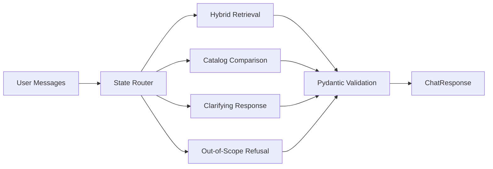

# Approach

## Architecture

AssessWise uses a deterministic conversation state machine around LLM-assisted components. A router classifies each turn into clarifying, retrieving, refining, comparing, or out-of-scope before any response is generated. Retrieval is catalog-backed and designed to combine structured filtering with semantic ranking. The response layer validates every outgoing payload against Pydantic schemas.

## Retrieval Design

The catalog is treated as the source of truth. Raw scraped records stay separate from cleaned records. Cleaned records include SHL fields plus taxonomy enrichment such as role families, skill domains, and seniority tags. Retrieval has two lanes:

- Structured filters for exact constraints like test type, role family, and known assessment names.
- Semantic ranking over enriched profile text for vague natural-language requests.

This hybrid design protects precision when the user gives explicit constraints and improves recall when the catalog descriptions are sparse.

## Conversation Design

The recommender does not let one open-ended LLM prompt decide everything. Turn behavior is governed by explicit states:

- `CLARIFYING`: ask one focused question.
- `RETRIEVING`: return 1 to 10 catalog-backed matches.
- `REFINING`: modify the existing shortlist with new constraints.
- `COMPARING`: compare matched catalog records only.
- `OUT_OF_SCOPE`: refuse unrelated or prompt-injection requests.

## Evaluation

The evaluation harness should replay the official traces and custom adversarial probes. Each run should track schema validity, recall@10, out-of-catalog URLs, and behavior-probe outcomes.

The assignment PDF references 10 public conversation traces, but the provided PDF contains placeholder text rather than a real download URL. Once the trace zip is obtained from the assignment portal/provider, place the trace JSON files in `data/traces/` and run `scripts/replay_traces.py` against the deployed or local endpoint.

## Trade-Offs

The first version favors transparency and deterministic safety over a heavy learned reranker. With more time, the system can add FAISS-backed embeddings, a stronger reranker, and a larger manually audited taxonomy.
